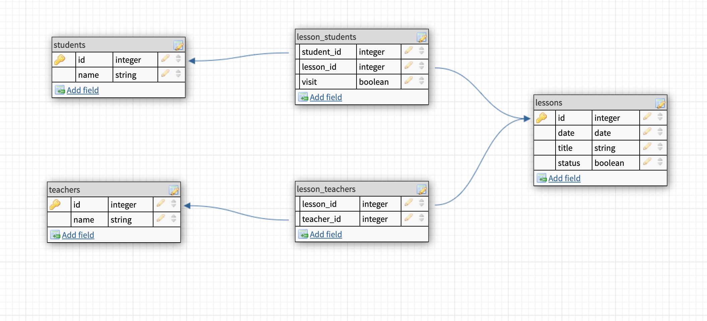

## Install the app
```bash
# clone app from git
$ git clone https://github.com/Newcss/NLessons.git
# cd to the app directory
$ cd NLessons
# install dependencies
$ npm install

```

## Running the app
```bash
# start app
$ docker-compose up

```
## Services
Pgadmin:
[http://localhost:5050/browser/#](http://localhost:5050/browser/#)

Api documentation: [http://localhost:3000/api](http://localhost:3000/api)

## Model data



## Description

An NestJS-based web server that works with data on classes, teachers and students. The data is stored in the PostgreSQL DBMS. Two tasks have been implemented. The first is data request, the second is data manipulation.
